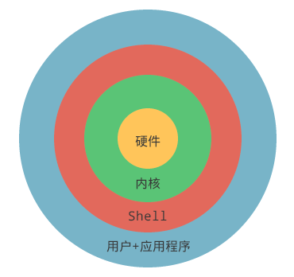
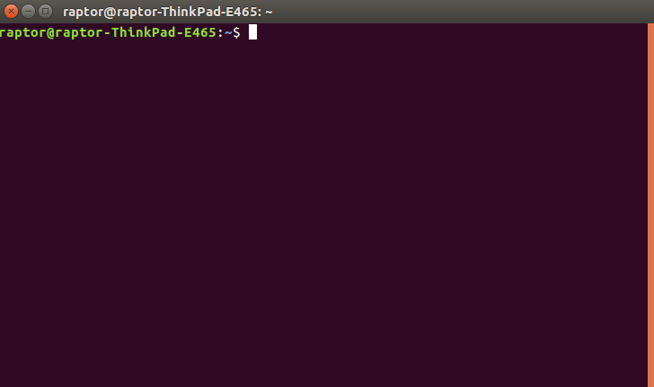
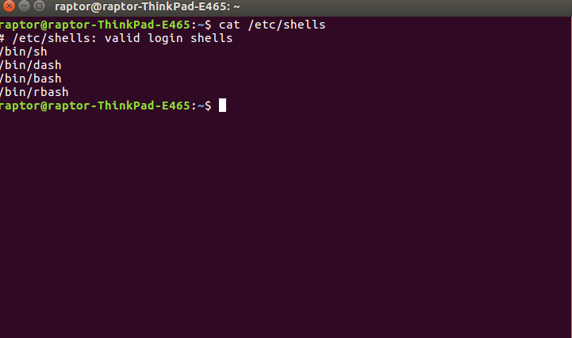
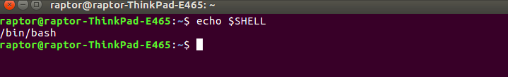

### 引言
现在我们使用的操作系统（Windows、Mac OS、Android、iOS 等）都是带图形界面的,然而在计算机的早期并没有图形界面，我们只能通过一个一个地命令来控制计算机。对于图形界面，用户点击某个图标就能启动某个程序；对于命令行，用户输入某个程序的名字（可以看做一个命令）就能启动某个程序。这两者的基本过程都是类似的，都需要查找程序在硬盘上的安装位置，然后将它们加载到内存运行。  
换句话说，图形界面和命令行要达到的目的是一样的，都是让用户控制计算机。然而，真正能够控制计算机硬件（CPU、内存、显示器等）的只有操作系统内核（Kernel），图形界面和命令行只是架设在用户和内核之间的一座桥梁。由于安全、复杂、繁琐等原因，用户不能直接接触内核（也没有必要），需要另外再开发一个程序，让用户直接使用这个程序；该程序的作用就是接收用户的操作（点击图标、输入命令），并进行简单的处理，然后再传递给内核。如此一来，用户和内核之间就多了一层“代理”，这层“代理”既简化了用户的操作，也保护了内核，见图1。  
  
用户界面和命令行就是这个另外开发的程序，就是这层“代理”。在Linux下，这个命令行程序叫做 Shell。
### 一.Shell是什么
Shell俗称壳（用来区别于核），是指“为使用者提供操作界面”的软件（命令解析器）。它类似于DOS下的command.com和后来的cmd.exe。它接收用户命令，然后调用相应的应用程序。作为命令语言，它交互式解释和执行用户输入的命令或者自动地解释和执行预先设定好的一连串的命令；作为程序设计语言，它定义了各种变量和参数，并提供了许多在高级语言中才具有的控制结构，包括循环和分支。
### 二.Shell的功能
Shell 除了能解释用户输入的命令，将它传递给内核，还可以：  
1. 调用其他程序，给其他程序传递数据或参数，并获取程序的处理结果；  
2. 在多个程序之间传递数据，把一个程序的输出作为另一个程序的输入；  
3. Shell 本身也可以被其他程序调用。  
Shell 本身支持的命令并不多，但是它可以调用其他的程序，每个程序就是一个命令，这使得 Shell 命令的数量可以无限扩展，其结果就是 Shell 的功能非常强大，完全能够胜任 Linux 的日常管理工作，如文本或字符串检索、文件的查找或创建、大规模软件的自动部署、更改系统设置、监控服务器性能、发送报警邮件、抓取网页内容、压缩文件等。
### 三.Shell的分类
shell基本上分两大类：  
一：图形界面shell（Graphical User Interface shell 即 GUI shell）  
例如：应用最为广泛的 Windows Explorer （微软的windows系列操作系统），还有也包括广为人知的 Linux shell，其中linux shell 包括 X window manager (BlackBox和FluxBox），以及功能更强大的CDE、GNOME、KDE、 XFCE。  
二：命令行式shell（Command Line Interface shell ，即CLI shell）  
例如：  
bash / sh / ksh / csh（Unix/linux 系统）  
（MS-DOS系统）  
cmd.exe/ 命令提示字符（Windows NT 系统）  
Windows PowerShell（支持 .NET Framework 技术的 Windows NT 系统）  
传统意义上的shell指的是命令行式的shell，以后如果不特别注明，shell是指命令行式的shell,如Linux系统的shell（见图2），进入方式有：通过Teminal终端图标进入或者通过快捷键“Ctrl+Alt+T”进入。  

其中bash shell 是 Linux 的默认 shell，可通过命令查看LInux系统可用的shell（见图3）和Linux系统默认的shell（见图3）  

