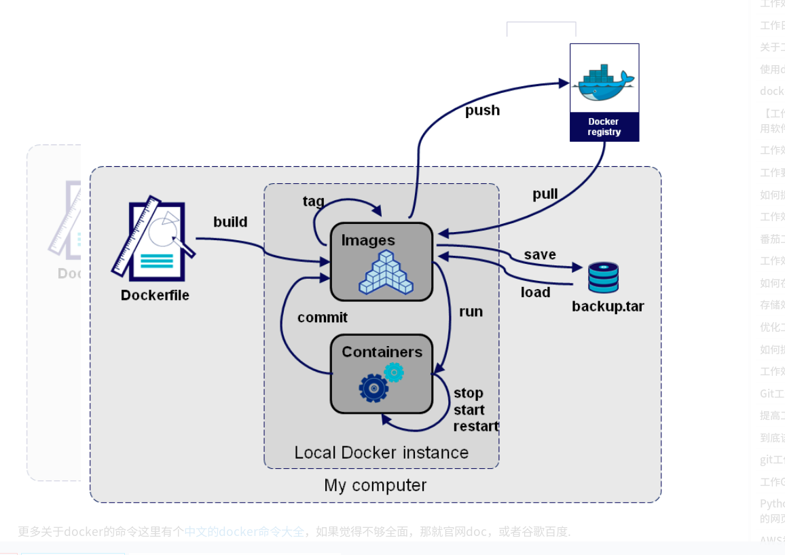
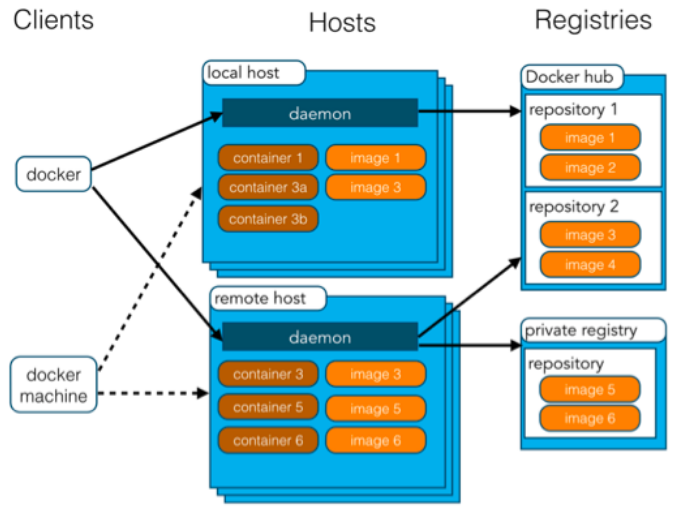

docker简介和安装
========
# docker介绍
Docker是一个开源的应用容器引擎，基于Go语言并遵从Apache2.0协议开源。Docker 可以让开发者打包他们的应用以及依赖包到一个轻量级、可移植的容器中，然后发布到任何流行的Linux机器上，也可以实现虚拟化。容器是完全使用沙箱机制，相互之间不会有任何接口（类似iPhone的app）,更重要的是容器性能开销极低。  
一个完整的Docker有以下几个部分组成：dockerClient客户端、Docker Daemon守护进程、Docker Image镜像、DockerContainer容器。  
# docker架构
Docker使用客户端-服务器 (C/S) 架构模式，使用远程API来管理和创建Docker容器。Docker容器通过Docker镜像来创建。容器与镜像的关系类似于面向对象编程中的对象与类。Docker采用 C/S架构Docker daemon作为服务端接受来自客户的请求，并处理这些请求（创建、运行、分发容器）。客户端和服务端既可以运行在一个机器上，也可通过 socket 或者RESTful API 来进行通信。Docker daemon 一般在宿主主机后台运行，等待接收来自客户端的消息。Docker客户端则为用户提供一系列可执行命令，用户用这些命令实现跟 Docker daemon 交互。  
# docker的使用场景
1、Web应用的自动化打包和发布。  
2、自动化测试和持续集成、发布。  
3、在服务型环境中部署和调整数据库或其他的后台应用。  
4、从头编译或者扩展现有的OpenShift或Cloud Foundry平台来搭建自己的PaaS环境。  
由于其基于LXC的轻量级虚拟化的特点，docker相比KVM之类最明显的特点就是启动快，资源占用小。因此对于构建隔离的标准化的运行环境，轻量级的PaaS(如dokku), 构建自动化测试和持续集成环境，以及一切可以横向扩展的应用(尤其是需要快速启停来应对峰谷的web应用)。  
* 构建标准化的运行环境，现有的方案大多是在一个baseOS上运行一套puppet/chef，或者一个image文件，其缺点是前者需要base OS许多前提条件，后者几乎不可以修改(因为copy on write 的文件格式在运行时rootfs是read only的)。并且后者文件体积大，环境管理和版本控制本身也是一个问题。  
* PaaS环境是不言而喻的，其设计之初和dotcloud的案例都是将其作为PaaS产品的环境基础。  
* 因为其标准化构建方法(buildfile)和良好的REST API，自动化测试和持续集成/部署能够很好的集成进来。  
* 因为LXC轻量级的特点，其启动快，而且docker能够只加载每个container变化的部分，这样资源占用小，能够在单机环境下与KVM之类的虚拟化方案相比能够更加快速和占用更少资源。  
# docker中的几个关键定义
* Docker image：镜像是只读的，镜像中包含有需要运行的文件。镜像用来创建container，一个镜像可以运行多个container；镜像可以通过Dockerfile创建，也可以从Docker hub/registry上下载。  
* Docker container：容器是Docker的运行组件，启动一个镜像就是一个容器，容器是一个隔离环境，多个容器之间不会相互影响，保证容器中的程序运行在一个相对安全的环境中。  
* Docker hub/registry：共享和管理Docker镜像，用户可以上传或者下载上面的镜像，官方地址为https://registry.hub.docker.com/，也可以搭建自己私有的Docker registry。镜像就相当于打包好的版本，镜像启动之后运行在容器中，仓库就是装存储镜像的地方。  
# docker的工作原理
Docker核心解决的问题是利用LXC来实现类似VM的功能，从而利用更加节省的硬件资源提供给用户更多的计算资源。同VM的方式不同, LXC 其并不是一套硬件虚拟化方法 - 无法归属到全虚拟化、部分虚拟化和半虚拟化中的任意一个，而是一个操作系统级虚拟化方法, 理解起来可能并不像VM那样直观。所以我们从虚拟化到docker要解决的问题出发，看看他是怎么满足用户虚拟化需求的。  
用户需要考虑虚拟化方法，尤其是硬件虚拟化方法，需要借助其解决的主要是以下4个问题:  
* 隔离性 - 每个用户实例之间相互隔离, 互不影响。 硬件虚拟化方法给出的方法是VM, LXC给出的方法是container，更细一点是kernel namespace 。   
* 可配额/可度量 - 每个用户实例可以按需提供其计算资源，所使用的资源可以被计量。硬件虚拟化方法因为虚拟了CPU, memory可以方便实现, LXC则主要是利用cgroups来控制资源。  
* 移动性 - 用户的实例可以很方便地复制、移动和重建。硬件虚拟化方法提供snapshot和image来实现，docker(主要)利用AUFS实现。  
* 安全性 - 这个话题比较大，这里强调是host主机的角度尽量保护container。硬件虚拟化的方法因为虚拟化的水平比较高，用户进程都是在KVM等虚拟机容器中翻译运行的, 然而对于LXC, 用户的进程是lxc-start进程的子进程, 只是在Kernel的namespace中隔离的, 因此需要一些kernel的patch来保证用户的运行环境不会受到来自host主机的恶意入侵, dotcloud(主要是)利用kernel grsec patch解决的。  
  
  
# 安装的前提条件
Docker 要求 Ubuntu 系统的内核版本高于 3.10 ，查看本页面的前提条件来验证你的 Ubuntu 版本是否支持 Docker。   
通过`uname -r`命令查看你当前的内核版本。  
针对ubuntu16.04使用脚本安装Docker  
参照官网教程https://docs.docker.com/install/linux/docker-ce/ubuntu/  
以选择国内的云服务商，这里选择阿里云为例  
运行`curl -sSL http://acs-public-mirror.oss-cn-hangzhou.aliyuncs.com/docker-engine/internet | sh -`  
## 安装所需要的包  
运行`sudo apt-get install linux-image-extra-$(uname -r) linux-image-extra-virtual`
## 添加使用 HTTPS 传输的软件包以及 CA 证书  
运行`sudo apt-get update`  
运行`sudo apt-get install apt-transport-https ca-certificates`  
## 添加GPG密钥  
运行`sudo apt-key adv --keyserver hkp://p80.pool.sks-keyservers.net:80 --recv-keys 58118E89F3A912897C070ADBF76221572C52609D`  
## 添加软件源
运行`echo "deb https://apt.dockerproject.org/repo ubuntu-xenial main" | sudo tee /etc/apt/sources.list.d/docker.list`  
## 添加成功后更新软件包缓存
运行`sudo apt-get update`  
## 安装docker
运行`sudo apt-get install docker-engine`  
## 启动 docker
运行`sudo systemctl enable docker`  
运行`sudo systemctl start docker` （发现sudo service docker start去启动docker服务，输入docker的指令后却没有反应，然后sudo service docker stop + sudo service docker start/sudo service docker restart重启docker 服务却没有反应，请ps -ef|grep docker察看所有docker进程，并且kill掉它们，再sudo service docker start就没有问题了）  
## 如果是非root用户可以执行  
运行`sudo usermod -aG docker runoob`  

用helloworld测试安装的docker
===========
# 测试hello-world
运行`sudo docker run ubuntu:15.10 /bin/echo "Hello world"`  （如果本地库中没有系统会自动从dockerhub远程库中进行下载）  
各个参数解析：  
* docker: Docker 的二进制执行文件。  
* run:与前面的 docker 组合来运行一个容器。  
* ubuntu:15.10指定要运行的镜像，Docker首先从本地主机上查找镜像是否存在，如果不存在，Docker 就会从镜像仓库 Docker Hub 下载公共镜像。  
* /bin/echo "Hello world": 在启动的容器里执行的命令  
以上命令完整的意思可以解释为：Docker 以 ubuntu15.10 镜像创建一个新容器，然后在容器里执行 bin/echo "Hello world"，然后输出结果。  
