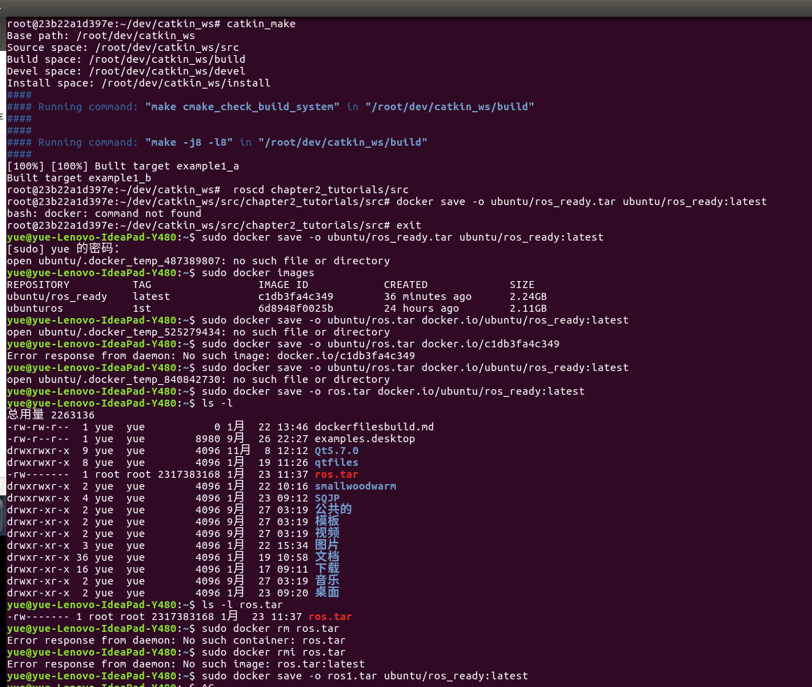
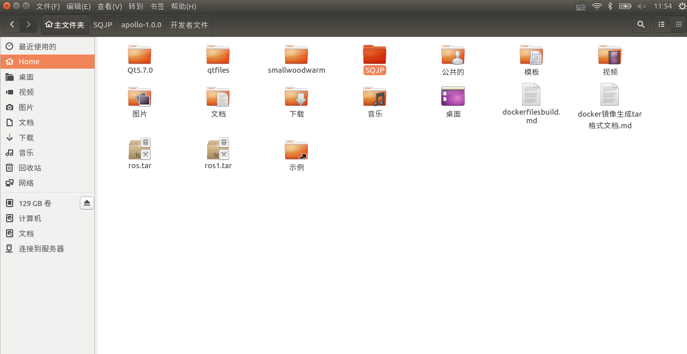
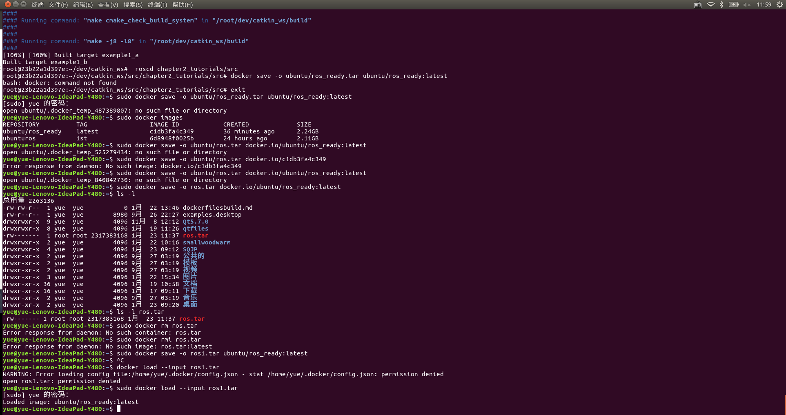

# 将保存好的镜像文件生成.tar格式文件
由于docker镜像文件只能保存到本地库中或者上传到dockerhub端，对于一些无网络用户造成了不便利性。所以本文给出生成和调用tar文件  
前文中我们将下载了ros的容器生成了新的镜像，命名为ubuntu/ros_ready:latest。  
执行`sudo docker save -o ros1.tar ubuntu/ros_ready:latest`命令便可以将上文我们生成的ubuntu/ros_ready:latest镜像文件生成一个名为ros1.tar的文件，这个回报保存在你的当前目录下。如下图所示：  
  
  
# 导入tar文件
执行`sudo docker load --input ros1.tar`便可以导入镜像文件，如下图所示  
  
# END
