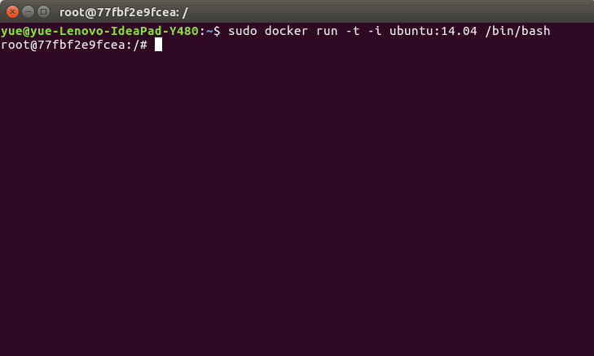
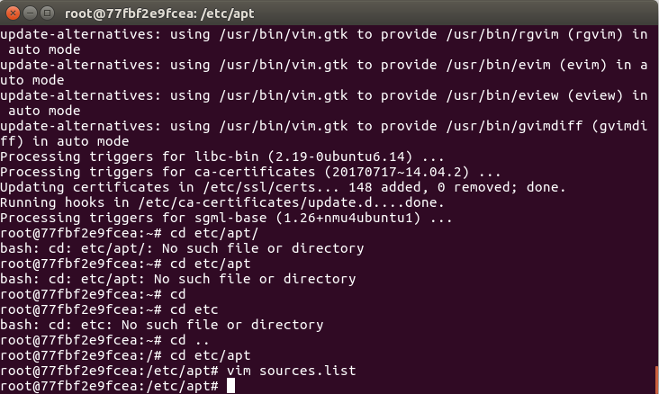
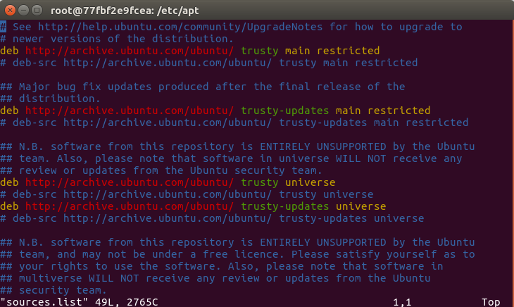
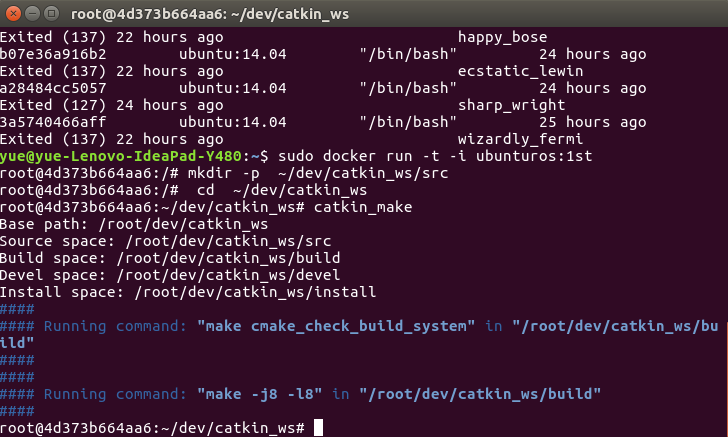
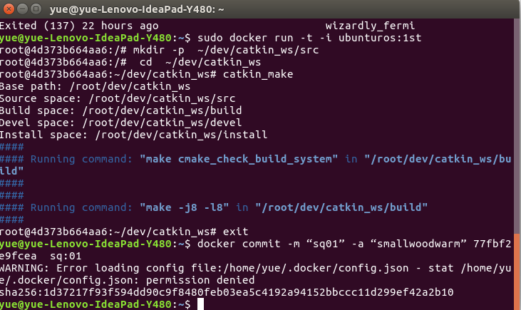
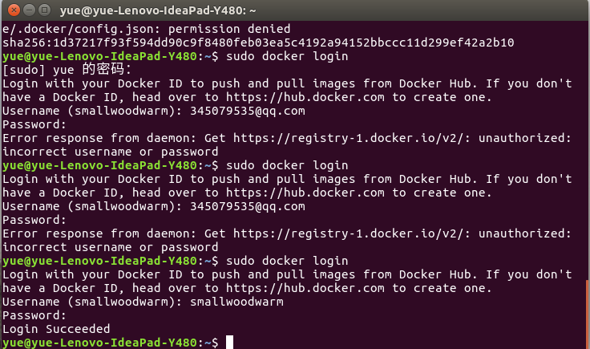

# 利用docker搭建ubuntu14.04下的ros环境
## 第一步 下载ubuntu14.04
* 运行`docker run -t -i ubuntu:14.04 /bin/bash`命令  
系统会查找本地库中有没有ubuntu14.04,如果没有会在docker远程端下载，结果图如下：  
  
出现如上图显示结果表明你已经进入了我们下载好的ubuntu14.04系统中，下面就可以安装ros环境了。  
如果使用`apt-get`命令遇到如下情况`E: Package 'vim' has no installation candidate`可以执行以下命令  
`apt-get update`  
`apt-get upgrade`  
`apt-get install <packagename>`  
## 第二步 安装ros环境
参考官网教程进行如下安装  
* untu14.04配置Ubuntu仓库允许"restricted," "universe," and "multiverse  
由于我们没有可视化界面所以只能用命令来进行编写，执行如下命令：  
`vim cd etc/apt/sources.list'打开文件进行手动添加。如下图所示如果没有vim的话可以使用`sudo apt-get install vim-gtk`进行安装  
  
  
vim编译命令为输入`i`，退出命令可以选以下任意个：`ZZ`，`shift+zz`，`：x`，`：wq`  
* 选择下载源  
运行`sudo sh -c '. /etc/lsb-release && echo "deb http://mirrors.ustc.edu.cn/ros/ubuntu/ $DISTRIB_CODENAME main" > /etc/apt/sources.list.d/ros-latest.list'`（中国）  
* 增加key  
运行`sudo apt-key adv --keyserver hkp://ha.pool.sks-keyservers.net:80 --recv-key 0xB01FA116`  
* 更新  
`sudo apt-get update`  
* Desktop-Full安装: (Recommended) : ROS, rqt, rviz, robot-generic libraries, 2D/3D simulators, navigation and 2D/3D perception  
`sudo apt-get install ros-indigo-desktop-full`  
* 解决依赖  
`sudo rosdep init`  
`rosdep update`  
* 环境设置  
`echo "source /opt/ros/indigo/setup.bash" >> ~/.bashrc`  
`source ~/.bashrc`  
* 安装rosinstall,便利的工具  
`sudo apt-get install python-rosinstall`  
安装之后可以建立ros工作环境，运行结果图如下图所示  
  
## 第三步 生成新的镜像并推送到docker hub中
* 退出当前容器命令可以选入下两种`ctrl+d`，`exit`  
* 输入`docker ps -a`查看当前有的所有容器，并记下刚刚安装软件的容器ID
* 运行`docker commit -m “Description” -a “users <users@163.com>” ID imagename:description`在本地库中生成image镜像文件并给出镜像ID如下图所示  
  
* 运行`sudo docker push imagename:description` 将刚生成的镜像上传到docker hub上。（第一次使用需要先进行登录，输入命令`docker login`登录）  
登录成功和失败的结果如下图所示  
  
恭喜你已经基本上掌握了docker的基础知识！  
