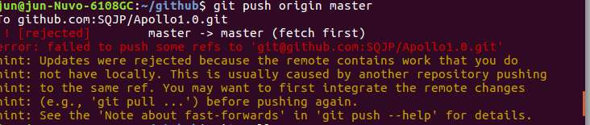
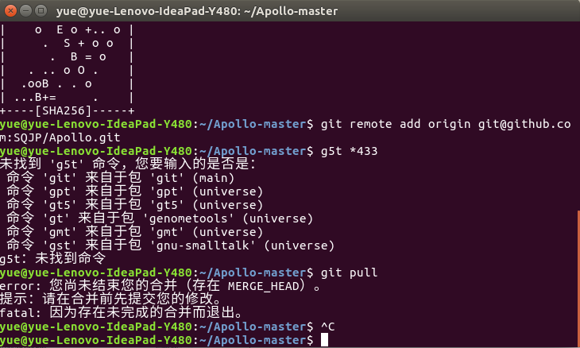
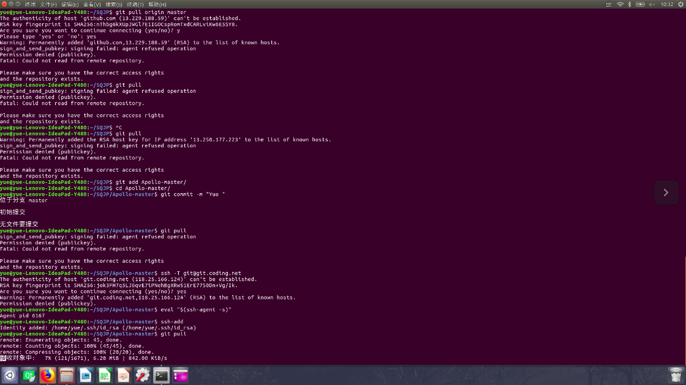
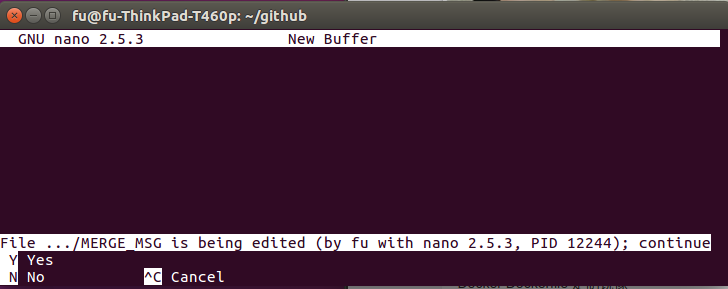
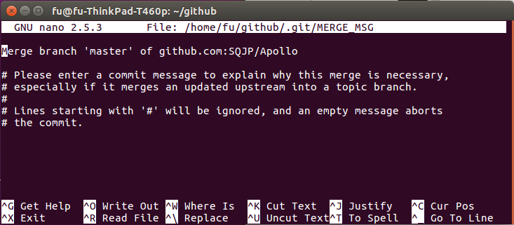

# 本文安装环境为ubuntu16.04,不一定适用于其他版本。
## 安装以及使用遇到的问题
1、安装git 后遇到登录问题时会提示如下问题，这个自行复制下列语句按要求登录自己github帐号就行。  
`it config -–global user.name "xxx"`   
`git config –-global user.email "xxx@xxx.com"`   
2、运行$ ssh-keygen -t rsa -C "youremail@example.com"后找不到.ssh文件可以运行ctrl+h来进行隐藏文件显示。  
3、如果遇到push不成功先检查与远程github库中的ssh关联的密钥是否添加。如果已经添加就需要检查本地库与远程库是否关联，git remote add origin git@github.com:michaelliao/learngit.git  
4、如果遇到如下情况，需要检查本地库与远程库版本是否一致或者本地版本新建的文件命名与github远程端文件有冲突。  
  
然后执行以下操作（1）git pull (同步本地仓库和远程仓库;(2)git status (查看已修改的文件);(3)重新git add 更改的文件;(4)git commit -m "修改说明";(5)重新上传 git push origin master。  
5、安装过程中遇到git pull 下下载不了的情况，提示本地库与远程库有文件尚未融合，但是自己又找不到尚未融合的文档时可以重新建立本地版本库。  
  
方法如下：（1）$ git branch  #显示所有本地分支;(2)$ git init   #初始化本地版本库;(3)$ ls -a    #找到目录下.git;(4)$ rm -rf  .git   #删除;(5)删除git之后 再去删除本地的库文件夹即可rm -rf XXXX  
如果遇到删除本地库后新建本地库提示  
` sign_and_send_pubkey: signing failed: agent refused operation Permission den`  
可以做如下操作（1）ssh -T git@git.coding.net;（2）eval "$(ssh-agent -s)";(3)ssh-add;成功之后显示为如下：Identity added: /home/chen/.ssh/id_rsa (/home/chen/.ssh/id_rsa)。  
  


## 运行git pull origin master命令时出现如下问题......
  
输入 Y 出现如下显示：  
  
原因分析：项目开发的其他小伙伴update了项目，但是我在没有pull 的情况下先修改了本地仓库下的文件，并进行了add,导致本地和远程仓库都发生了变化，也就是出现了冲突，这时cmd提示你有人修改了nano ,让你写一个冲突记录。  
解决方法：因为我们最终的目标是要合并本地仓库和远程仓库，所以我们可以忽略这样的改变，使用以下命令。
```
 git pull --no-edit origin master
```
就可以将本地和远程库进行合并，完了就可以使用push命令上传本地改变到远程库了。
